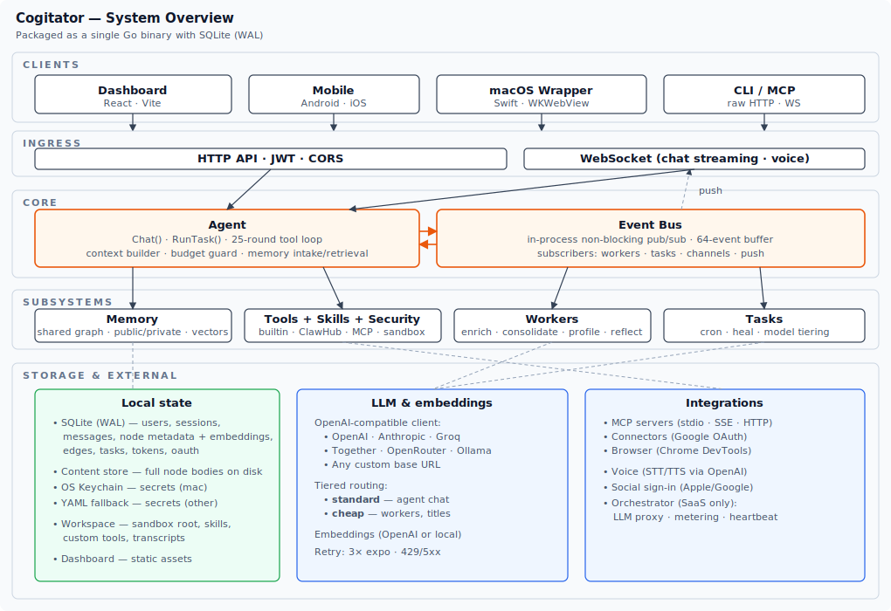
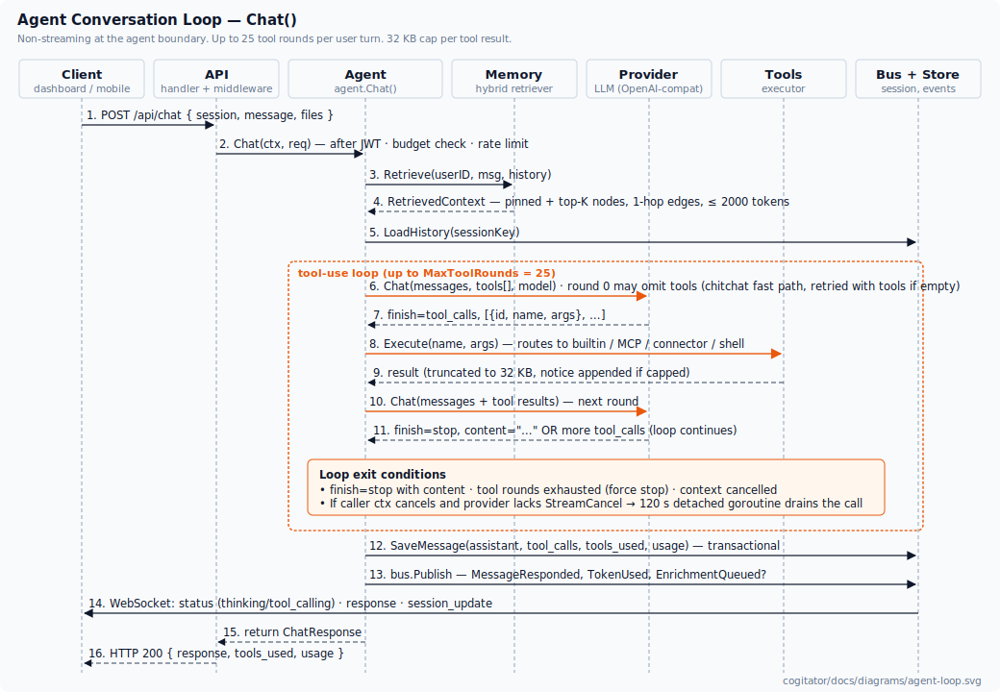
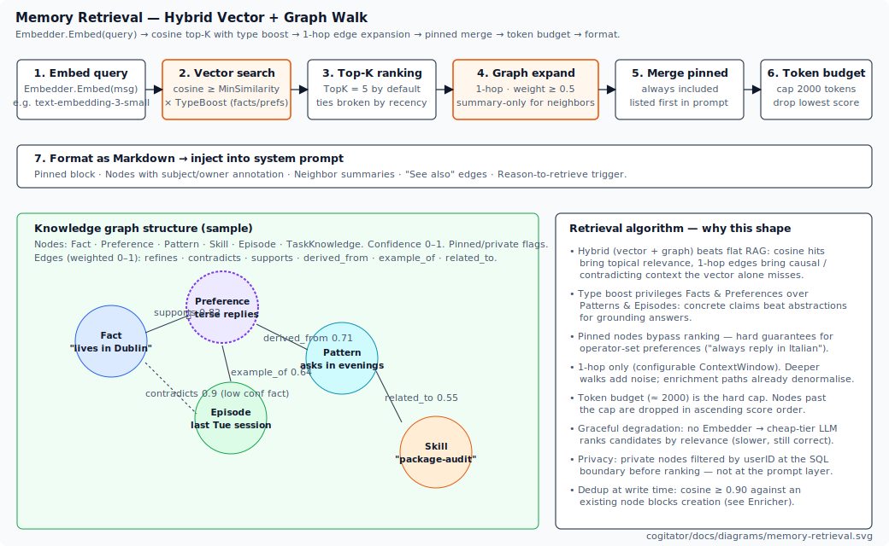
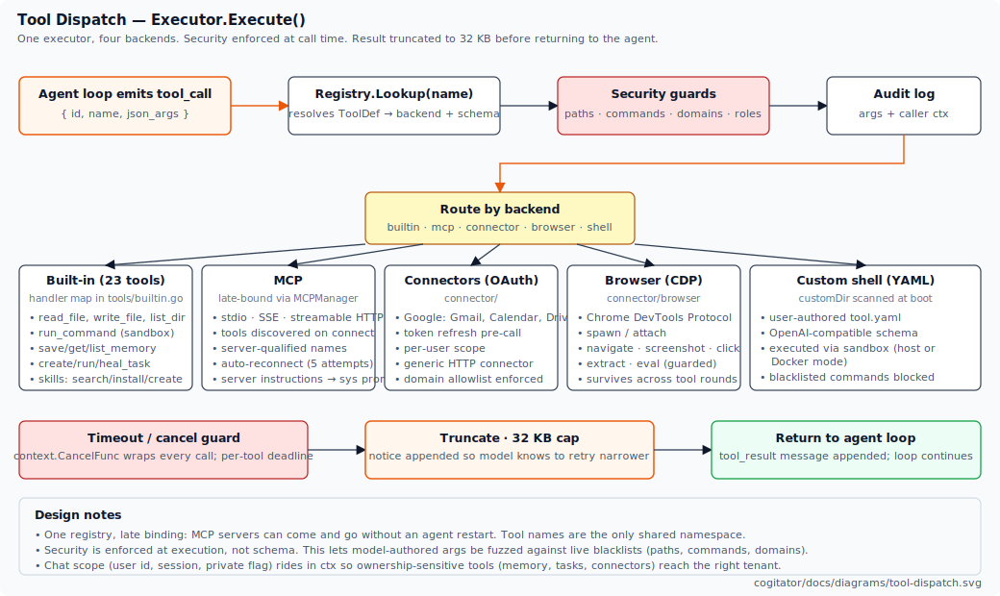
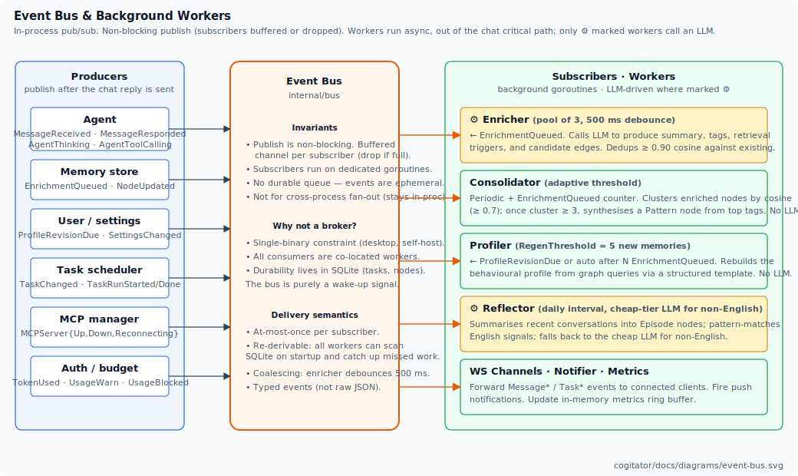
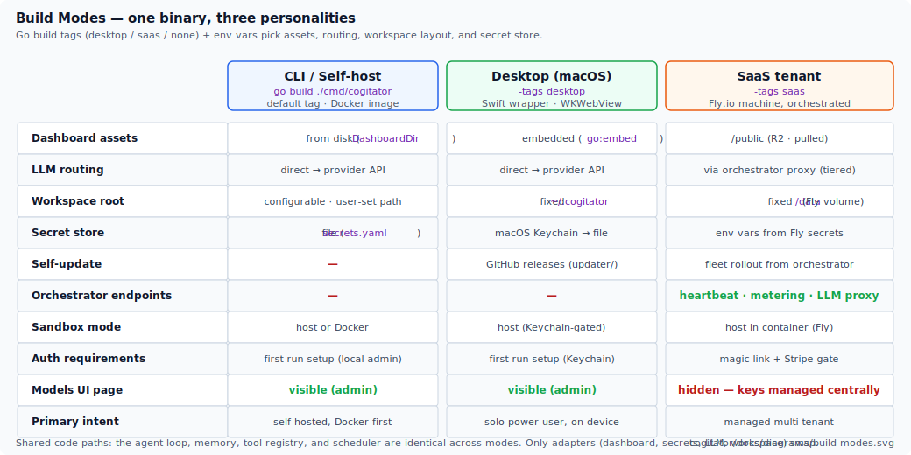

# Cogitator Platform Architecture

A technical deep-dive for readers comfortable with LLM tool-use, embeddings, agent
loops, and RAG. This document covers the `cogitator/` tree only — the Go server
(`cogitator/server/`) and the React dashboard (`cogitator/dashboard/`). Mobile,
orchestrator (SaaS control plane), homepage, and macOS wrapper are out of scope
and live outside this directory.

> Part 1 sketches the system. Part 2 explains *why* each subsystem looks the way
> it does. Diagrams are under `./diagrams/`.

## Table of contents

- [Part 1 — Quick overview](#part-1--quick-overview)
- [Part 2 — In-depth walkthrough](#part-2--in-depth-walkthrough)
  - [2.1 The agent loop](#21-the-agent-loop)
  - [2.2 Provider abstraction](#22-provider-abstraction)
  - [2.3 Memory as a knowledge graph](#23-memory-as-a-knowledge-graph)
  - [2.4 Tool system](#24-tool-system)
  - [2.5 Background workers and the event bus](#25-background-workers-and-the-event-bus)
  - [2.6 MCP integration](#26-mcp-integration)
  - [2.7 Task scheduler](#27-task-scheduler)
  - [2.8 Authentication and authorization](#28-authentication-and-authorization)
  - [2.9 Channels](#29-channels)
  - [2.10 API layer](#210-api-layer)
  - [2.11 Dashboard](#211-dashboard)
  - [2.12 Persistence](#212-persistence)
  - [2.13 Build modes and configuration](#213-build-modes-and-configuration)
- [Appendix A — Key types](#appendix-a--key-types)
- [Appendix B — Package map](#appendix-b--package-map)

---

## Part 1 — Quick overview

### What Cogitator is

Cogitator is a **personal AI agent platform** packaged as a single Go binary
(`cogitator/server/`) plus a React dashboard (`cogitator/dashboard/`). It hosts
an agent loop with tool use, a knowledge-graph memory, a task scheduler, and
pluggable transport (HTTP/WebSocket, Telegram). The same source tree ships as a
self-hosted CLI, a native macOS app, or a managed SaaS tenant — selected by Go
build tags (`desktop`, `saas`) and environment variables rather than by
forking code paths.

### System at a glance



The server listens on port 8484. Every request flows through JWT auth,
CORS, a metrics ring buffer, and a drain gate. From there, `handleChat` and
`/ws` are the two hot paths; almost everything else is CRUD over SQLite.

### Core ideas (five)

1. **Agentic loop with iterative tool use.** One `agent.Chat()` call. Up to 25
   tool rounds. Non-streaming at the agent boundary (the LLM round-trip blocks;
   the *client* sees streaming via WebSocket events). This keeps cancellation
   and persistence ordering clean.
2. **Knowledge graph memory, not flat RAG.** Nodes have types
   (`fact`, `preference`, `pattern`, `skill`, `episode`, `task_knowledge`) and
   weighted edges. Retrieval is hybrid: vector top-K, then a one-hop graph walk,
   gated by a token budget.
3. **Unified tool registry.** Built-in tools, MCP servers, OAuth connectors,
   and headless-browser tools all pass through the same `Executor`. Security
   (path allowlist, command blacklist, domain allowlist) enforces at call time,
   not schema time.
4. **Background workers behind an event bus.** Enrichment runs on the cheap
   LLM tier; consolidation and profiling are deterministic graph synthesis
   with no LLM call; reflection is pattern-matched in English with a
   cheap-tier LLM fallback for non-English. All workers run async, driven by
   typed events. The hot path (user message, tool use, reply) never waits
   for a worker.
5. **One binary, three personalities.** CLI / desktop / SaaS differ only in
   adapters (dashboard source, LLM routing, workspace root, secret store).
   The agent loop, memory, tools, and scheduler are identical.

### Stack

| Layer | Choice | Notes |
|---|---|---|
| Server | Go 1.25 | `cogitator/server/`, module `github.com/cogitatorai/cogitator/server` |
| HTTP | `net/http` + `http.ServeMux` | Handler groups organised by feature; no framework |
| DB | SQLite (WAL), raw SQL, no ORM | One file at workspace root |
| JWT | `golang-jwt/v5` (HS256) | Short access + hashed-on-disk refresh |
| LLM client | custom (`/chat/completions` + `/embeddings`) | OpenAI-compatible for OpenAI, Anthropic, Groq, Together, OpenRouter, Ollama |
| MCP | `mark3labs/mcp-go` | stdio, SSE, streamable HTTP |
| Cron | `robfig/cron/v3` | 5-field expressions; DB-persistent jobs |
| ULIDs | `oklog/ulid/v2` | Monotonic IDs everywhere |
| Dashboard | React 19, Vite 7, Tailwind 4, TS 5.9 | Hash routing, no react-router, no Redux |
| Streaming | WebSocket (`/ws?token=<JWT>`) | Exponential-backoff reconnect |
| Graph viz | D3 force layout | Memory page |

### Deployment modes

| Mode | Build tag | Dashboard | LLM | Workspace | Secrets |
|---|---|---|---|---|---|
| CLI / self-host | (none) | from disk | direct to provider | configurable | file |
| Desktop (macOS) | `desktop` | `go:embed` | direct to provider | `~/.cogitator` | Keychain → file |
| SaaS tenant | `saas` | `/public` (R2 pulled) | **orchestrator LLM proxy** | `/data` | Fly secrets env |

The SaaS build is the only one that advertises internal endpoints
(`/api/internal/heartbeat`, metering reporting) and routes LLM traffic through
the orchestrator. Everything else is shared.

---

## Part 2 — In-depth walkthrough

### 2.1 The agent loop

The agent is the system's beating heart (`internal/agent/`). A single call to
`Agent.Chat(ctx, req)` or `Agent.RunTask(...)` executes the full conversation
turn: memory retrieval, LLM calls, iterative tool dispatch, persistence, and
event emission.



**Why non-streaming at the agent boundary?** The LLM API returns a response
(or a batch of tool calls), and only once that completes does the agent
decide whether to continue. Token-level streaming would expose partial state
across tool boundaries and make persistence ordering ambiguous. Clients still
*perceive* streaming through bus events (`AgentThinking`, `AgentToolCalling`,
`MessageResponded`) forwarded over WebSocket. Activity state is streamed;
response content is a single committed block.

**The tool-use loop.** Each provider turn returns either a terminal message or
a batch of `tool_calls`. The agent appends the returned call IDs and their
results to the message list, then invokes the provider again. The loop caps at
`MaxToolRounds = 25`. This is an anti-runaway limit: in practice, healthy
turns finish in 1 to 4 rounds. When the cap trips, the loop is forced to stop
and the final assistant message is whatever the provider returned last.

**Tool-result truncation.** Every tool result is capped at **32 KB**. If the
cap fires, a trailing notice tells the model that output was truncated so it
can retry with tighter arguments (narrower grep, smaller paging). Without this,
one bloated `list_dir` or HTTP fetch can poison the remaining budget in a
single round.

**Cancellation semantics.** Providers can opt in to
`CapabilityProvider.Capabilities() → [StreamCancel]`. When advertised, the
caller's `context.Context` is passed straight through — cancelling the HTTP
client aborts the request. For providers that cannot safely be cancelled
mid-stream, the agent runs the call in a detached goroutine with a 120-second
timeout, so the LLM transaction gracefully drains even if the WebSocket has
disconnected. This avoids orphaned LLM charges while keeping the UI
responsive.

**Budget gate.** Before any work happens, `budget.Allow(userID, tier)` is
checked. Tier is inferred from the caller's model override (`standard` or
`cheap`). When the RPM limit or the daily token limit is hit, the agent
returns a structured error and never talks to the provider.

**Cost-saving fast paths.** Two opt-in heuristics shave LLM cost on the
critical path. The session-title generator (fired once per new session)
routes to the `cheap` tier when one is configured, falling back to
`standard` otherwise. The tools-off fast path (env var
`COGITATOR_TOOLS_OFF_FAST_PATH=1`, default off) inspects the first user
message: on conservative chitchat patterns (greetings, acks, short
non-question replies), the round-0 LLM call omits the tool schema entirely
and saves the input tokens that schema would consume. If the model returns
empty content, the agent retries once with tools, capped at one retry.
Both heuristics default to safe behaviour: title falls back to standard if
cheap is not configured; the tools-off path is opt-in.

**Task mode.** `RunTask()` prepends `[TASK EXECUTION]` to the prompt, which
steers the model to return a concrete result rather than delegating to a
sub-task or replying conversationally. Task runs share the agent machinery but
write to a dedicated session so their transcripts do not pollute chat
history.

**Why one function?** Tool-use code typically splits across a dozen helpers.
We kept `Chat()` monolithic on purpose: the ordering of persist / emit / retry
matters, and inlining makes it auditable. Subsystems (memory, tools, provider)
are injected as interfaces, so the function is still testable without being
fragmented.

### 2.2 Provider abstraction

`internal/provider/` exposes a single interface:

```go
type Provider interface {
    Chat(ctx context.Context, messages []Message, tools []Tool,
         model string, opts ...Option) (Response, error)
}
```

One concrete implementation (`OpenAI`) covers **all** current backends. A
base URL and API key are configured at construction; model names route to
different endpoints via a `knownBaseURLs` map (OpenAI, Anthropic, Groq,
Together, OpenRouter, Ollama). Custom base URLs pass through unchanged, so
self-hosted `vllm` / TGI deployments work out of the box.

**Why one client instead of per-provider adapters?** The chat-completions
schema has become the de-facto standard. Tool-calling, multimodal content
arrays, and tool-result messages all converge. The few semantic differences
(Anthropic's system prompt rules, Groq's token headers) are absorbed by field
rename at serialization time. Writing a second adapter would double the
retry/backoff/cancel logic for a vanishingly small benefit.

**Retry strategy.** Three exponential retries on 429 or 5xx, honouring
`Retry-After` when present. 4xx is fast-fail. Context cancellation is never
retried. The HTTP client has a 120-second timeout — the same as the agent's
detached-goroutine timeout, matching cancellation behaviour end-to-end.

**Embeddings.** Covered by a separate `Embedder` interface, implemented by the
same `OpenAI` struct against `/embeddings`. The memory retriever degrades
gracefully when no embedder is configured (see §2.3).

**Cache token telemetry.** Both OpenAI and the Anthropic-compat
chat-completions endpoint automatically cache stable input prefixes (≥ 1024
tokens for OpenAI; equivalent shape for Anthropic). The provider decodes
`prompt_tokens_details.cached_tokens` (OpenAI) and
`cache_creation_input_tokens` (Anthropic) into
`Usage.CacheReadTokens` and `Usage.CacheCreationTokens`, accumulated across
the tool loop and surfaced via the `MessageResponded` bus payload. The
agent's iterative tool rounds (rounds 2+ within a turn share the same
system prompt and tools) are the natural cache-hit pattern. No request-side
`cache_control` markers are emitted; the upstreams cache without them.

**Model tiers.** The config has two named tiers: `standard` and `cheap`.
Each binds to a `(provider, model)` pair. Tasks, workers, and the chat path
each pick a tier. In SaaS mode the tier is resolved on the orchestrator
(using the tenant's plan) rather than the tenant, so API keys never leave the
control plane.

### 2.3 Memory as a knowledge graph

`internal/memory/` stores what the agent remembers about each user. Unlike
flat vector RAG (chunks → cosine → concat), memory here is an explicit
**typed graph** built up by enrichment.



**Node types.** `fact`, `preference`, `pattern`, `skill`, `episode`,
`task_knowledge`. Each carries a short `Summary`, a longer content path (text
body stored separately — keeps SQLite rows small), `Tags`, `Confidence`
(0–1), `EnrichmentStatus`, `Pinned`, `Private`, and `UserID`.

**Edge relations.** `refines`, `contradicts`, `supports`, `derived_from`,
`example_of`, `related_to`. Each edge has a `Weight` in [0, 1]. The graph is
directed; most traversals treat it as undirected for retrieval.

**Retrieval pipeline** (`retriever.go`):

1. **Embed the query.** `Embedder.Embed([]string{message})`. Missing embedder
   triggers the LLM fallback path: the cheap-tier provider ranks candidate
   nodes by relevance. Slower and coarser, but keeps the system functional
   without a paid embeddings key.
2. **Vector search.** Cosine similarity over pre-computed node embeddings.
   Scores below `MinSimilarity` (0.3 default) drop out. A `TypeBoost`
   multiplier (1.1 default) privileges facts and preferences over patterns and
   episodes; direct claims beat abstractions for grounding answers.
3. **Top-K.** Configurable (`TopK = 5`). Ties broken by recency.
4. **Graph expansion.** For each top-K node, follow edges with weight ≥ 0.5
   one hop out. Neighbour nodes are included as *summaries only* (not full
   content) to keep context cost down while still surfacing related evidence.
5. **Pinned nodes.** Always included, regardless of K. They render first in
   the prompt and exist so operators can anchor behaviour ("always reply in
   Italian") without retraining or prompt-engineering.
6. **Token budget.** Hard cap (≈ 2000 tokens). Nodes past the cap are dropped
   in ascending score order. This stops memory context from evicting actual
   conversation history on long sessions.
7. **Format.** Rendered as Markdown with subject/owner annotations and a
   "See also" block listing edge relations. Injected as part of the system
   prompt.

**Why a graph?** The contradiction and refinement edges matter. When a new
fact contradicts a stored one, retrieval can surface both, letting the agent
ask for clarification instead of confidently echoing stale data. Flat vector
search cannot express "A supersedes B".

**Write-time deduplication.** Before writing a new node, the enricher computes
its embedding and drops it if cosine similarity to any existing node exceeds
**0.90**. Without this, memory accretes paraphrases and retrieval gets noisy.

**Privacy.** `Private` nodes are filtered by `UserID` at the SQL boundary, not
at the prompt layer. A shared session cannot inadvertently surface another
user's private memory because the filter applies before ranking.

### 2.4 Tool system



The tool registry (`internal/tools/`) is the single namespace the LLM sees.
It merges five backends behind one `Executor.Execute(name, args)`:

- **Built-in (23)** — file I/O, shell (`run_command`), memory CRUD, task
  management, skills, utilities (`search`, `fetch`, `notify_user`).
- **MCP** — tools discovered from stdio / SSE / streamable-HTTP servers. Names
  are server-qualified to avoid collisions.
- **Connectors** — OAuth-backed (Google Gmail / Calendar / Drive today, with
  a generic HTTP connector for one-off APIs).
- **Browser** — Chrome DevTools Protocol. Navigate, click, extract, screenshot,
  guarded JS eval. The browser process survives across tool rounds so the
  agent can do multi-step browsing in one turn.
- **Custom shell** — user-authored YAML definitions scanned from a `customDir`
  at boot. The YAML schema mirrors OpenAI's function format, so conversion
  is identity.

**Dispatch.** Each turn, the agent calls `Executor.Execute` for every tool the
LLM returned. Calls are serial per turn (the provider returns a batch, but we
execute them in order so errors short-circuit cleanly). Results are appended
to the message history with the matching `tool_call_id`.

**Security at call time.** The executor checks:

- File paths against a sensitive-path blacklist (`~/.ssh`, `~/.aws`, configured
  extras). Blocks read *and* write.
- Shell commands against a dangerous-command blacklist (`rm -rf /`, fork
  bombs, etc.) and — in `sandbox.Mode == docker` — against an additional
  image-wide policy.
- Outbound HTTP against the domain allowlist. Fetches to off-allowlist
  hosts fail before a connection is made.

All checks happen at execution, not schema. This matters: the LLM can invent
plausible arguments that the schema accepts but policy rejects, and we want to
catch that at the guard, not at the model.

**Audit.** Every tool call is logged with arguments, caller context, and
(truncated) result. The log feeds the dashboard's activity view and survives
restart.

**Chat scope.** `ctx` carries the caller's `UserID`, `SessionKey`, and a
`Private` flag. Ownership-sensitive tools (`save_memory`, `create_task`,
`notify_user`) read these values rather than trusting LLM-supplied IDs.

### 2.5 Background workers and the event bus

`internal/bus` is a typed in-process pub/sub. `internal/worker/` hosts four
LLM-driven consumers.



**Invariants.**

- `Publish` is non-blocking. Each subscriber has a buffered channel. If the
  buffer is full, the event is dropped for that subscriber — workers treat the
  bus as a wake-up signal, not a durable queue. Missed wake-ups are corrected
  on the next wake or at startup (each worker does a scan-and-catch-up).
- Subscribers run on dedicated goroutines. Workers cannot block each other.
- Events are typed Go structs, not opaque JSON.
- No cross-process fan-out. This stays in-proc because every consumer is
  co-located in the same binary.

**Why no broker?** The single-binary constraint (desktop, self-host, SaaS
tenant) rules out Redis/NATS/Kafka. Durability already lives in SQLite: tasks,
node enrichment status, task runs. The bus exists only so workers do not have
to poll.

**Enricher** (`worker/enricher.go`). Listens for `EnrichmentQueued`. A pool of
**3 workers** with a **500 ms debounce** coalesces bursts (a rapid sequence
of memory writes from one turn collapses into a handful of LLM calls).
For each node, the enricher asks the model to produce a summary, tags,
retrieval triggers, and candidate edges to existing nodes. Cosine-dedup
against existing embeddings blocks duplicates at the 0.90 threshold.

**Consolidator** (`worker/consolidator.go`). Periodic + event-driven. Clusters
enriched nodes by cosine (≥ 0.7); once a cluster has ≥ 3 members, a
`pattern` node is synthesised deterministically from the cluster's top
tags, retrieval triggers, and source titles. No LLM call. Trigger threshold
is **adaptive**: `threshold = MinThreshold + total_nodes / Scale` (defaults
5, 5, 20), so consolidation fires more often when the KB is small and less
often as it grows.

**Profiler** (`worker/profiler.go`). Rebuilds the user's behavioural profile
document (injected into the system prompt) by querying the memory graph
for facts, preferences, and patterns and rendering them through a
structured template. Triggers on `ProfileRevisionDue` (user-initiated) or
after `RegenThreshold = 5` new enrichments. No LLM call: the profile is
template assembly from graph queries.

**Reflector** (`worker/reflector.go`). Daily. Summarises recent conversations
into `episode` nodes; classifies behavioural signals into new facts,
preferences, or follow-up tasks. English signals are pattern-matched
directly; non-English falls back to a cheap-tier LLM classifier.

**Why LLM-only at ingest?** A rule-based knowledge graph would require a
taxonomy and a schema for every new type of insight. LLM-driven enrichment
lets the graph grow organically. Once a node is enriched (summary, tags,
edges, embeddings), downstream workers (consolidator, profiler) operate on
the structured graph deterministically. The LLM signal is paid for once at
ingest, not every time a pattern is consolidated or a profile is
regenerated. The only structural invariants enforced are node types, edge
relations, and the 0.90 dedup threshold.

### 2.6 MCP integration

`internal/mcp/` runs Model Context Protocol servers as long-lived companions
of the server process. The `Manager` owns connection lifecycle and merges
every connected server's tools into the main registry.

**Transports.**

- **stdio** — the server starts the MCP server as a subprocess and speaks
  JSON-RPC over stdin/stdout. Most official MCP servers.
- **SSE** / **streamable HTTP** — for remote servers.

**Lifecycle.** Servers declared in `mcp.json` (or managed via the dashboard)
start at boot. `ListTools` populates the registry. Tools are named
`<server>:<tool>` to avoid collisions. On disconnect, up to 5 exponential
backoff reconnects, with `MCPServerReconnecting` events emitted so the UI can
show state. Fatal misconfiguration (e.g., missing binary) surfaces as an
error row in the dashboard without bringing the server down.

**Server instructions** — each MCP server can advertise a free-form
instruction string. These are concatenated into the system prompt so the
agent has context on *when* to prefer a server's tools.

### 2.7 Task scheduler

`internal/task/` turns the user's prompts into recurring jobs. Built on
`robfig/cron/v3`.

**Persistence.** Tasks live in SQLite (`tasks` + `task_runs`). On startup the
scheduler reloads all enabled tasks and registers them with the cron runner.
The `TaskChanged` bus event triggers live reload — the UI can create and
toggle tasks without a restart.

**Execution.** Each fire creates a `TaskRun` row (status `running`), then
calls `Agent.RunTask()` with the task's prompt and selected model tier.
Concurrent runs of the same task are blocked: a task that is still running
when cron fires again is skipped (and optionally flagged to the heal loop).
The run result is persisted; `TaskRunDone` is emitted; notifications go out
per the task's notification config.

**Wake-from-sleep.** On laptops, the process can miss fires. The scheduler
monitors wall-clock jumps and backfills missed runs for tasks marked
`catch_up`. Tasks without `catch_up` skip the missed window — desirable for
"post a summary every morning" (we do not want to fire seven at once after a
week off).

**Heal loop.** A `heal_task` tool lets the agent auto-fix tasks that fail
repeatedly: it can rewrite the prompt, change the schedule, or notify the
user. This is the escape hatch for "you set up a cron job, you forgot about
it, it has been failing silently for a week."

### 2.8 Authentication and authorization

`internal/auth/` + API handlers in `internal/api/auth_handlers.go`.

**Tokens.** HS256 JWTs, two kinds:

- **Access** — short-lived (minutes). `Claims{UserID, Role, exp, ...}`.
  Sent as `Authorization: Bearer <token>` or `?token=<JWT>` for WebSocket.
- **Refresh** — long-lived (days). Opaque hex string; only a **SHA-256 hash**
  is stored server-side. A database dump alone cannot restore session access.

**Refresh rotation.** Single-use. Each refresh call rotates the pair and
invalidates the old refresh token. The dashboard deduplicates concurrent
refreshes through a single in-flight promise to avoid rotating itself into a
loss-of-session race.

**OAuth.** Google (ID-token exchange with signature verification). Apple
similarly. The flow is: frontend obtains ID token → backend verifies →
backend issues Cogitator JWT pair. We never store the provider's tokens.

**Roles.** `admin`, `moderator`, `user`. Enforced per handler via a
`requireRole` wrapper. Admin-only UI pages (Models, Resources, Users) are
gated in the dashboard shell as well — never just client-side.

**Invite codes.** Optional gating of registration for self-hosted mode.
Admins issue one-time codes; new users consume a code on `/api/auth/register`.
Useful when you run Cogitator on a public URL but only want your family on it.

**First-run setup.** Self-hosted and desktop modes present a `/setup` flow
that creates the first admin (no invite needed, but only if no users exist).

### 2.9 Channels

`internal/channel/` is the transport layer that connects external clients to
`agent.Chat()`. Two implementations today.

**WebSocket** (`web.go`). Upgrades `/ws?token=<JWT>`, validates the token,
then binds the connection to a `(user_id, session_key)` pair. Per-connection
state: active request context (for cancellation), subscription set. Inbound
events:

- `subscribe` — switch the active session.
- `message` — submit a user message.
- `cancel` — abort the in-flight request.

Outbound events mirror the bus:

- `status` — `thinking` / `tool_calling`, scoped to the active session.
- `response` — final assistant content with resolved `tools_used`.
- `session_update` / `session_title` / `session_deleted` — list invalidation.
- `cancelled` — confirms an abort.
- `task_completed` / `task_failed` / `notification` — asynchronous task
  events destined for desktop / push notifications.

**Telegram** (`telegram.go`). Long-poll against the Bot API. Each Telegram
chat maps to a Cogitator session keyed by `(user_id, chat_id)`. The same
`Agent.Chat()` handles the turn. Replies are formatted to Telegram's Markdown
subset.

The bus is the backbone: the conversation loop does not know which transport
will display its output, only that it publishes `MessageResponded`. Channels
subscribe and forward.

### 2.10 API layer

`internal/api/router.go` wires about **111 routes** across ~20 handler groups.
The router is `http.ServeMux` with a middleware chain applied on the outside:

```
drain ─► metrics ─► CORS ─► JWT auth ─► mux
```

- **drain** — graceful shutdown gate. Rejects new requests during shutdown
  while existing ones finish.
- **metrics** — a fixed-size ring buffer of latency + status per route.
  Fed to the dashboard's Resources page. Zero allocations in the hot path.
- **CORS** — configured allowlist (dashboard origin in SaaS; permissive in
  dev).
- **JWT auth** — parses `Authorization` / WS query token, attaches claims to
  context, blocks anon routes.

Handler groups (selected):

| Prefix | Purpose |
|---|---|
| `/api/auth/*` | register, login, refresh, logout, social (Google, Apple), setup |
| `/api/chat`, `/ws` | primary interaction |
| `/api/sessions/*` | list, get, clear |
| `/api/memories`, `/api/memory/*` | node CRUD, graph, stats, enrichment control |
| `/api/tasks`, `/api/tasks/*` | CRUD, runs, trigger |
| `/api/skills/*` | search, install, create |
| `/api/tools`, `/api/tools/*` | list, execute (debug/admin) |
| `/api/mcp/servers/*` | lifecycle, tool discovery, secrets |
| `/api/connectors/*` | OAuth, browser CDP, connector settings |
| `/api/settings*`, `/api/me*` | config, profile, version, updates |
| `/api/health`, `/api/status` | liveness + build info |
| `/api/internal/*` | SaaS-only; heartbeat, metering, LLM proxy client side |

Handlers are thin adapters over the internal services. Validation is
per-handler (there is no global schema layer). Errors are returned as JSON
with status codes.

### 2.11 Dashboard

`cogitator/dashboard/` is a **React 19 + Vite 7 + Tailwind 4** SPA. TypeScript
5.9 strict. Important aesthetic/architectural choices:

**No react-router.** Hash-based routing (`#chat/<session>`, `#memory`, ...).
Route table is a `Set<Page>`. `hashchange` syncs to React state. Deep links
like `#chat/tasks:output` encode multipart session keys.

**No Redux / no Zustand.** Three React contexts:

- `AuthContext` — user, tokens, refresh deduplication. Tokens stored in
  `localStorage` (`cogitator_access_token`, `cogitator_refresh_token`). The
  desktop wrapper can seed `window.__COGITATOR_AUTH_TOKEN__` for zero-click
  sign-in; the dashboard promotes it to localStorage on first use.
- `WebSocketContext` — lazy single connection, exponential backoff
  (1 s → 10 s, factor 1.5×). Re-subscribes to the active session on open.
  JWT sent as `?token=<JWT>` because browsers cannot set headers on WS
  upgrades.
- `ThemeContext` — light/dark with `prefers-color-scheme` fallback.

**Streaming UI.** The `response` event carries the full assistant message
(batched server-side). Inter-turn activity is streamed via `status` events.
No token-level streaming at the frontend. Markdown is rendered with
`react-markdown` + `remark-gfm`.

**Memory graph.** D3 force layout (`forceLink`, `forceManyBody`,
`forceCenter`, `forceCollide`). Node colours per type; dashed pinned outline;
edge labels surface relation + weight on hover. Data polled at 30 s; node
detail fetched on demand.

**SaaS awareness.** The bootstrap `/api/status` payload carries a `saas` flag.
When true: the Models page is hidden (tier-config is centralised in the
orchestrator); a subscription banner appears; usage is polled every 30 s and
a warning banner triggers past the metering thresholds.

**Build.** `npm run build` runs `tsc -b && vite build`. Dev server proxies
`/api`, `/ws`, and `/api/ollama/pull` (streaming SSE) to `localhost:8484`,
with `x-accel-buffering: no` to disable Vite's proxy buffering for streams.

### 2.12 Persistence

**SQLite, WAL mode, no ORM.** One `cogitator.db` file in the workspace root.
Raw SQL with nullable type scanning. The case against an ORM in this
codebase:

- Queries are hand-tuned for the knowledge graph (type + pin filters +
  top-K from a join on embeddings). An ORM would either generate worse SQL
  or require raw escape hatches, defeating the point.
- SQLite's query planner rewards explicit index hints; we want them visible.
- The schema is small enough (≈ 20 tables) that direct SQL is not a
  maintenance problem.

**Core tables.** `users`, `sessions`, `messages`, `nodes`, `edges`,
`node_embeddings`, `tasks`, `task_runs`, `token_usage`, `notifications`,
`push_tokens`, `invite_codes`, `user_oauth_links`, `refresh_tokens`, plus
per-subsystem bookkeeping.

**Two migration paths** (see root `CLAUDE.md`):

- **Idempotent** — `CREATE TABLE IF NOT EXISTS`, `ALTER TABLE ADD COLUMN`.
  Runs on every boot. Default for additions.
- **Numbered** — ordered SQL files, tracked by a `schema_migrations` table,
  each runs exactly once. Required for renames, type changes, data
  transformations.

**N-1 compatibility.** Every migration must leave the schema readable by the
previous binary. This is the operational contract that makes SaaS fleet
rollbacks safe (see §2.13): if a tenant's machine rolls back after a
migration, the previous binary must still function against the migrated
schema. Destructive changes therefore take two releases: add the new shape
and dual-write in release N, remove the old shape in N+1.

### 2.13 Build modes and configuration



**Go build tags.** `go build ./cmd/cogitator` yields the CLI binary.
`-tags desktop` flips to embedded dashboard + Keychain + fixed workspace.
`-tags saas` wires the LLM proxy client, exposes `/api/internal/*`,
and pulls dashboard assets from `/public`.

**Config resolution order.**

1. Defaults (hard-coded).
2. `cogitator.yaml` from the workspace root.
3. Env vars. SaaS mode reads `COGITATOR_ORCHESTRATOR_URL`,
   `COGITATOR_TENANT_ID`, `COGITATOR_INTERNAL_SECRET` from Fly secrets.
4. `.env` loaded via `godotenv` at startup.

**Secrets.** `internal/secretstore` writes/reads from OS Keychain on macOS
(via `zalando/go-keyring`); falls back to `secrets.yaml` when keyring is
unavailable (Linux Docker, containers). SaaS reads from env only.

**Dashboard assets.** Build-tag switched:

- default: served from `DashboardDir` (configurable path)
- `desktop`: served from `go:embed`
- `saas`: served from `/public` (populated from R2 by the deploy pipeline)

The rest — routes, schema, agent loop — is single-source. New features land
once and run in all three modes.

---

## Appendix A — Key types

```go
// agent
type ChatRequest struct {
    UserID, SessionKey, ChatID string
    Message string
    Attachments []Attachment
    MemoryContext *memory.RetrievedContext
    ModelOverride string
    Private bool
}
type ChatResponse struct {
    Content string
    Usage provider.Usage
    ToolsUsed []ResolvedTool
}

// provider
type Provider interface {
    Chat(ctx context.Context, msgs []Message, tools []Tool,
         model string, opts ...Option) (Response, error)
}
type Embedder interface {
    Embed(ctx context.Context, texts []string, model string) ([][]float32, error)
}
type CapabilityProvider interface {
    Capabilities() []Capability   // e.g. StreamCancel
}

// memory
type Node struct {
    ID ULID
    Type NodeType       // fact|preference|pattern|skill|episode|task_knowledge
    Title, Summary, ContentPath string
    Tags []string
    Confidence float32
    EnrichmentStatus enrichStatus
    Pinned, Private bool
    UserID string
}
type Edge struct {
    SourceID, TargetID ULID
    Relation EdgeRelation  // refines|contradicts|supports|derived_from|example_of|related_to
    Weight float32
}
type RetrievedContext struct {
    Pinned, TopK []*Node
    Neighbours map[ULID][]*Node
    TokenBudgetUsed int
}

// tools
type ToolDef struct {
    Name, Description string
    Parameters JSONSchema
    Backend Backend  // builtin|mcp|connector|browser|shell
    Command, WorkingDir string  // shell only
}
type Executor interface {
    Execute(ctx context.Context, name string, args json.RawMessage) (string, error)
}

// task
type Task struct {
    ID, Name, Prompt string
    CronExpr string
    ModelTier string   // "standard" | "cheap"
    Enabled bool
    Timeout time.Duration
    NotifyRecipients []string
}
type TaskRun struct {
    ID, TaskID ULID
    Trigger Trigger   // cron|manual|heal
    Status Status     // running|success|failed
    StartedAt, EndedAt time.Time
}

// session
type Session struct {
    Key ULID
    Channel string    // web|telegram|task
    ChatID, UserID string
    IsActive, Private bool
}
type Message struct {
    ID ULID
    SessionKey ULID
    Role string       // system|user|assistant|tool
    Content string
    ToolCalls []provider.ToolCall
    ToolsUsed []agent.ResolvedTool
    Metadata json.RawMessage
}
```

## Appendix B — Package map

Server (`cogitator/server/internal/`):

| Package | One-liner |
|---|---|
| `app` | Server wiring, subsystem init, graceful shutdown. |
| `agent` | Conversation loop: LLM calls, tool execution, message persistence. |
| `api` | HTTP router (~111 endpoints), middleware chain, handler groups. |
| `auth` | JWT (access + refresh), user/role management, OAuth. |
| `database` | SQLite WAL, idempotent schema + numbered migrations. |
| `config` | YAML loader, env overrides, secret store integration. |
| `session` | Chat session/message CRUD, user/channel scoping. |
| `memory` | Knowledge graph (nodes + edges), vector embeddings, retrieval. |
| `worker` | Background: enricher, profiler, consolidator, reflector. |
| `tools` | Tool registry, executor, built-in tools, MCP/connector adapters. |
| `connector` | OAuth integrations (Google), browser CDP. |
| `mcp` | MCP client lifecycle (stdio/SSE), server discovery, tool registration. |
| `task` | Scheduled tasks, cron scheduler, executor, heal loop. |
| `skills` | ClawHub search, skill install/create. |
| `channel` | Chat transports: WebSocket (`/ws`), Telegram bot. |
| `provider` | LLM abstraction (OpenAI-compatible), embeddings, multi-model. |
| `sandbox` | Shell execution: host or Docker mode, command blacklist. |
| `voice` | STT/TTS (OpenAI Whisper, TTS). |
| `notification` | Task result notifications, push tokens (mobile). |
| `user` | User store, roles, profile overrides. |
| `bus` | In-process event bus, non-blocking pub/sub. |
| `security` | Path allowlists, dangerous command blocks, domain whitelist. |
| `budget` | Token usage limits, daily budgets, RPM rate limiting. |
| `heartbeat` | SaaS tenant heartbeat (nil in CLI/desktop). |
| `drain` | Graceful-shutdown request gate. |
| `dashboard` | Embedded / on-disk dashboard asset adapter. |
| `fileproc` | File upload parsing (PDF, DOCX, images). |
| `frontend` | Assets serving wiring. |
| `metrics` | In-memory request metrics ring. |
| `ollama` | Ollama model management endpoints. |
| `push` | Mobile push notification senders. |
| `ratelimit` | Token-bucket limiter. |
| `secretstore` | Keychain / file secret backend. |
| `social` | OAuth provider glue (Apple, Google). |
| `updater` | Desktop self-update against GitHub releases. |
| `version` | Build-time version injection. |
| `workspace` | Workspace root resolution, path guards. |

Dashboard (`cogitator/dashboard/src/`):

- `App.tsx` — shell, route gating, auth redirects.
- `auth.tsx` — `AuthProvider`, token lifecycle, refresh deduplication.
- `ws.tsx` — `WebSocketProvider`, reconnect logic.
- `api.ts` — fetch wrapper, token provider, `sendChatMessage`.
- Pages: `Chat`, `Tasks`, `History`, `Memory`, `Skills`, `Connectors`,
  `Models`, `Resources`, `Users`, `Settings`, `Account`, `Login`,
  `Register`, `SignUp`, `Connect`.
- `MemoryGraph.tsx` — D3 force-directed knowledge-graph view.
